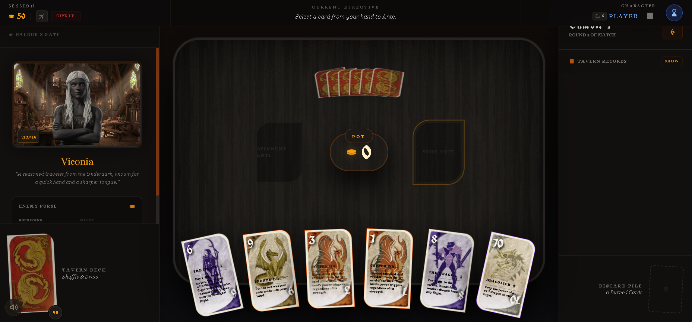

# Minigames Module

## Purpose
The Minigames module provides lightweight, narrative-integrated interactive experiences that allow the party to resolve minor conflicts or pass time through chance and simple strategy.

## Components

### 1. Coin Flip (`src/components/minigames/CoinFlip.tsx`)
A physics-inspired coin toss simulation used for "fateful" decisions.
- **Mechanics**:
    - User predicts "Heads" or "Tails".
    - 2-second animation with a 3D-rotating coin.
    - Sound effects for the toss (`coin_swoosh.wav`).
    - Tracks score between the "Oracle" (CPU) and the "Traveler" (User).
- **Integration**: Managed via `coinFlipState` in `useGameStore.ts`.

### 2. Rock Paper Scissors (`src/components/minigames/paperScissorRock.tsx`)
A "Ritual Arena" game for social interactions or minor wagers.
- **Mechanics**:
    - 3-second countdown ("Ritual").
    - NPC hand color dynamically matches their `visualTraits.skinTone` metadata.
    - Outcome logic: Rock beats Scissors, Scissors beats Paper, Paper beats Rock.
    - Tracks score and displays narrative results (e.g., "Agreement Secured").
- **Integration**: Managed via `rpsState` in `useGameStore.ts`.

### 3. Three-Dragon Ante
A strategic card game played in taverns across Faerûn.


## State Management (`useGameStore.ts`)

### `coinFlipState`
```typescript
interface CoinFlipState {
  status: 'idle' | 'tossing' | 'result';
  prediction: 'heads' | 'tails' | null;
  result: 'heads' | 'tails' | null;
  score: { user: number; cpu: number; };
}
```

### `rpsState`
```typescript
interface RpsState {
  status: 'ritual' | 'result';
  userChoice: 'rock' | 'paper' | 'scissors' | null;
  cpuChoice: 'rock' | 'paper' | 'scissors' | null;
  countdown: number;
  score: { user: number; cpu: number; };
}
```

## UI/UX Features
- **Arena Mode**: Adaptive layout that allows the games to be rendered in a dedicated full-screen arena or a smaller sidebar/panel.
- **Framer Motion**: Smooth animations for hand rituals, coin spins, and UI transitions.
- **Game Icons**: Utilizes the `GameIcon` registry for high-quality SVG symbols.
